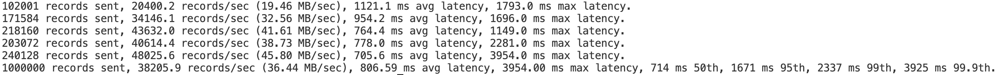
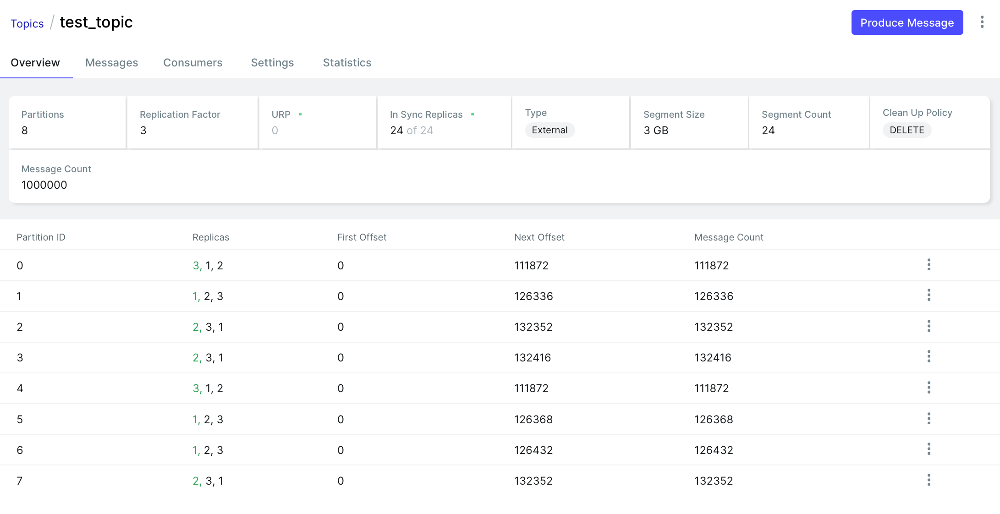
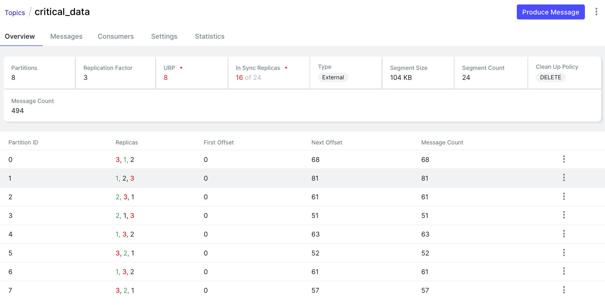
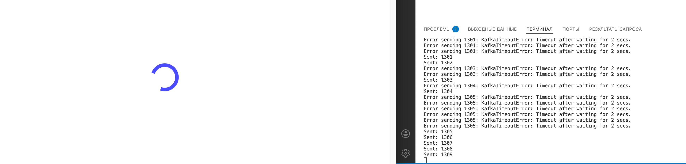
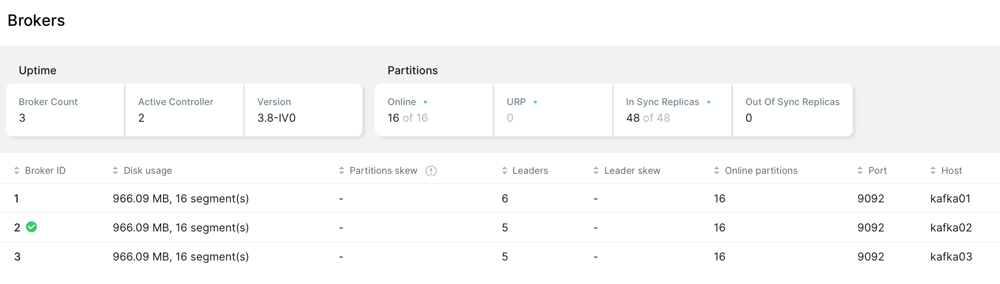

# HW 2

## Характеристики топика
- 8 партиций, хороший вариант для начала работы
- Replication Factor: 3
- In Sync Replicas: 24 of 24, все реплики синхронизированы
- Cleanup Policy: DELETE, подходит для топика поток событий

## Нагрузочное тестирование
#### Генерация:

#### Результат:

#### Анализ:
- Дошел весь миллион сообщений
- События есть на всех брокерах
- Средняя Latency: 806ms
- RPS: 38205.9 records/sec

## Отказоустойчивость
#### Отрубаем контроллер

#### Анализ:
- Сообщения в брокер еще летят
- ISR упал
- URP стал 8, так как для каждой партиции не хватает одной реплики

## Отрубаем второй контроллер:

#### Анализ:
- UI умер, так как нет кворума -> UI не может получить метаданные
- Сообщения редко доходят, так как продьюсер падает по таймауту

## Восстановление:

#### Анализ:
- С кластерами все хорошо, работа системы полностью восстановлена