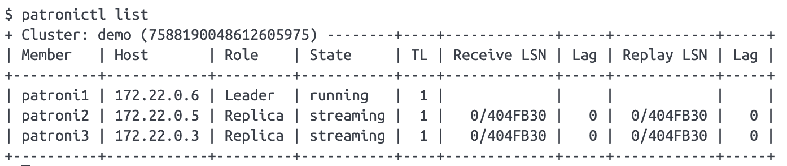
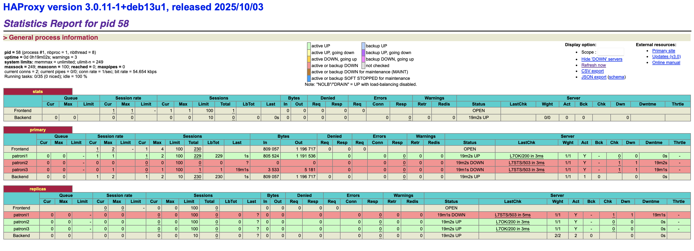
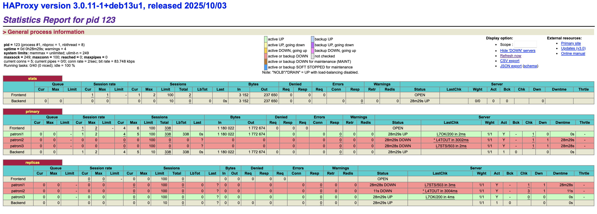
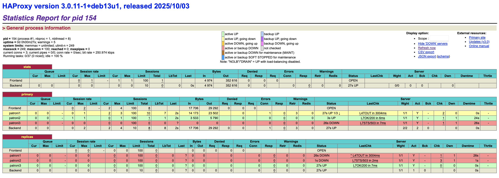
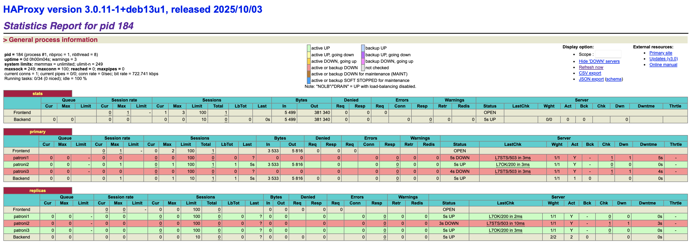
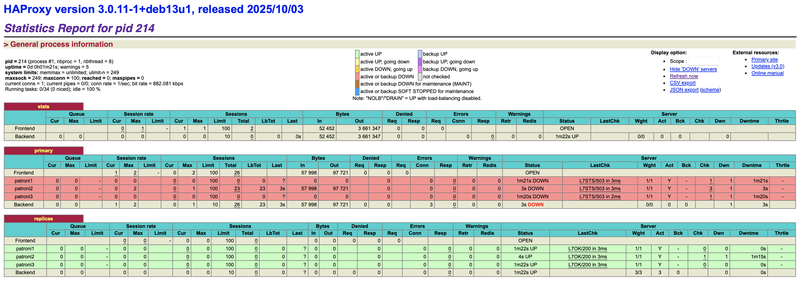
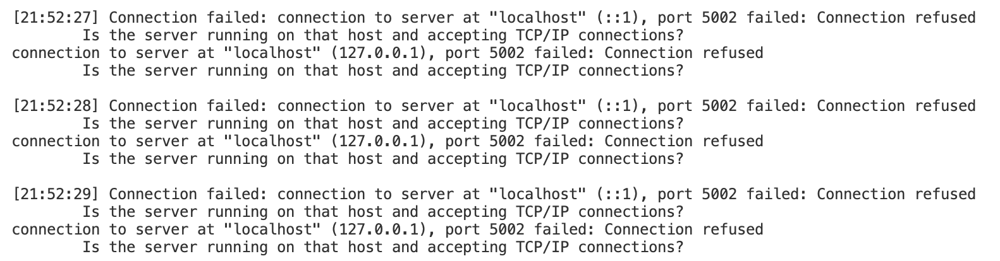

# HW 3

## Состав кластера

- Один узел лидер, находится в статусе running (работает как основной сервер)
- Два узла реплики, находятся в статусе streaming (получает WAL)

## HAPROXY

- Сервис жив, и работает уже 19 минут
- patroni1 единственный определяется как primary
- patroni2 и patroni3 определяются как реплики

## Пробуем отключать ноды Patroni
#### Выключаем реплику
Скрипт работает

#### Выключаем праймари
Скрипт упал, но после перезапуска ожил
Тут видно как реплика стала праймари нодой

#### Включаем бывший праймари обратно
Видно что он не стал снова праймари
Скрипт продолжил работу без изменений

## Пробуем отключать ноды etcd
#### Выключим одну ноду
Ничего не происходит, инсерты идут

#### Выключаем еще одну ноду
Через какое то время все ноды стали репликами, а скрипт перестал вставлять значения

#### Что произошло?
Когда осталась только одна нода, etcd потерял кворум и перестал работать для Patroni. Праймари нода не смогла продлить Lease и стала репликой, чтобы избежать Split-Brain

## Выключаем HAProxy
Кластер продолжил работать, но извне до него теперь не достучаться, так как нет HAProxy

